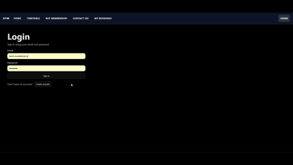

# 🏋️‍♂️ Gym Management System
## Web application for managing gym chains, schedules, and memberships.

> [!IMPORTANT]
> **Prototype Version:** This project is a prototype developed for a Software Engineering course. The primary goal was to experience the business side of commercial projects and practice professional teamwork rather than building a final, production- ready product.

## 📺 Video Preview

## 🏢 Project Origins
The project began with a **formal business interview** with our client, **Mr. Janusz Biceps**, the founder of a rapidly growing gym network. 
As his business expanded, managing sales, member records and class bookings manually became impossible. 
Our team's mission was to create a digital system that gives users easy access to account creation, membership purchases and class reservations while helping management stay organized.

## 🛠️ How it works
The system serves four main groups of users: **Clients, Trainers, Receptionists and Managers**. 
Clients can register, buy various types of memberships (one- time, monthly, or yearly) and book group or individual sessions. Trainers manage their own availability and individual training sessions, while Receptionists handle "walk- in" customers and check- in members at the door. Managers oversee the entire facility, creating group schedules and monitoring statistics.

---

## 📑 Project Documentation & Business Logic
Before coding, we focused heavily on the business and planning side of the project.

* **Project Specification & Dictionary:** To ensure clear communication, we developed a professional dictionary defining terms like "Home Club", "Individual Pass", and "Penalty System".
* **Database Modeling:** We designed a comprehensive ERD (Entity Relationship Diagram) using **Oracle Data Modeler**.
* **UML Architecture:** We created UML class diagrams to define the system's logic and service interactions.
* **Backlog Management:** We prepared a detailed backlog with tasks estimated using the **Fibonacci sequence**, allowing for efficient work distribution.

## 📐 Architecture & Tech Stack
The project is built as a modern web application using a containerized environment to ensure a consistent setup for all developers.

### Technology Stack 
* **Backend:** Python with **FastAPI** framework.
* **Frontend:** **React** library with **TypeScript**.
* **Database:** **PostgreSQL** relational database.
* **DevOps:** **Docker** for environment consistency.
* **Testing:** **Postman** for API endpoint verification.

---

## ⚙️ Key Features
* **Flexible Memberships:** Supports various tiers (Gym or Gym+Sauna) and durations (One- day to Yearly).
* **Advanced Booking System:** Clients can book group classes or 1:1 sessions with personal trainers. Includes automatic limit checks (max 10 individual sessions per facility).
* **Attendance Discipline:** A "penalty system" that deducts 1 day from a membership validity if a user misses a booked class without canceling.
* **Trainer Management:** Trainers can check room availability in real- time before scheduling individual sessions.
* **Manager Dashboard:** Managers can easily add new sessions to the timetable by selecting a instructor, time and room.

---

## 📝 Lessons Learned
This was our first experience working in a shared professional repository. We successfully learned how to:
* **Manage Workflows:** Use Pull Requests, create feature branches and resolve merge conflicts.
* **Business Analysis:** Transition from a client interview to a technical specification and a prioritized Backlog.
* **Team Balance:** We realized the importance of equal task distribution; for example, we learned that assigning more people to the backend than the frontend can create a bottleneck for the UI developers.

## 👥 The Team
This project was a collaborative effort by:
* **Antonina Chruściel** 
* **Emilia Kura** 
* **Roman Dovhal** 
* **Jakub Hanusiak** 
* **Artsiom Karzhaneuski** 
* **Jan Stanek** 
